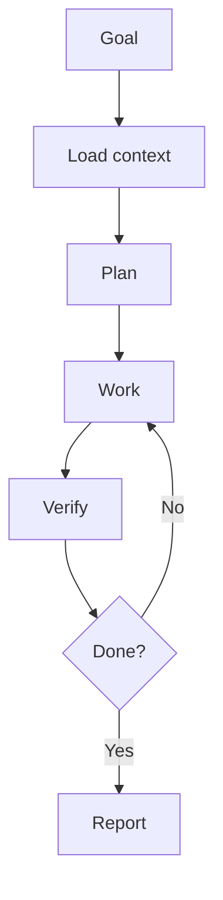

# AGENTS.md

All AI coding agents working in this repository must follow AI Engineering Operating System.

## Required loop

## Agent rules

- Load context before editing.
- Plan before implementation.
- Work in small reversible steps.
- Verify with available tools.
- Update docs and wiki sources when public docs change.
- Report evidence honestly.
