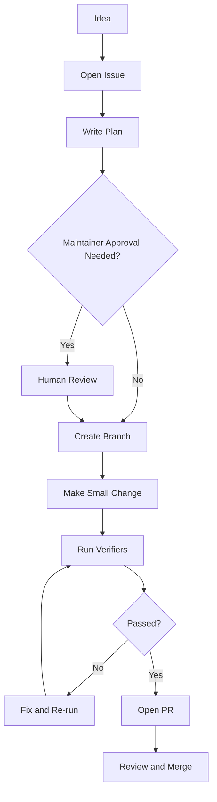

# Contributing

AI-OS contributions must improve clarity, safety, repeatability, or verification.

## Contribution loop

## Required for PRs

- Clear goal
- Scope and non-goals
- Verification evidence
- Updated docs when behavior changes
- Mermaid diagrams for new workflows
- Human approval for broad governance, release, or security changes

## Canonical source

The `/docs` tree is canonical. Wiki pages are curated navigation pages that point back to canonical docs.
