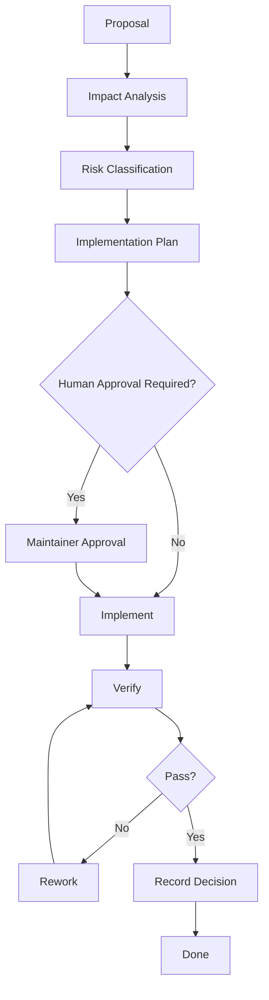

# Governance

AI-OS governance is based on explicit goals, human approval gates, verification evidence, and reversible change.

## Governance loop

## Approval required

- Release process changes
- Security policy changes
- Governance changes
- Breaking changes to master prompt semantics
- Automation that can mutate repositories
- Anything that increases risk or cost

## Decision records

Use ADRs for structural decisions. ADRs must explain context, decision, alternatives, consequences, and rollback.
