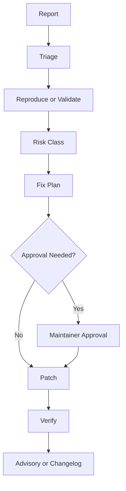

# Security Policy

AI-OS includes guidance for autonomous and semi-autonomous coding agents. Security reports may include documentation issues, unsafe workflow patterns, prompt-injection risks, tool-use escalation, secret exposure, or CI/CD risk.

## Report privately

Use GitHub private vulnerability reporting where available.

## Scope

- AI agent instructions that could encourage unsafe actions
- Tool-use escalation risks
- Prompt-injection or context-poisoning risks
- Workflow permissions and CI/CD safety
- Secrets or credential exposure
- Release, approval, or governance bypasses

## Security review loop

