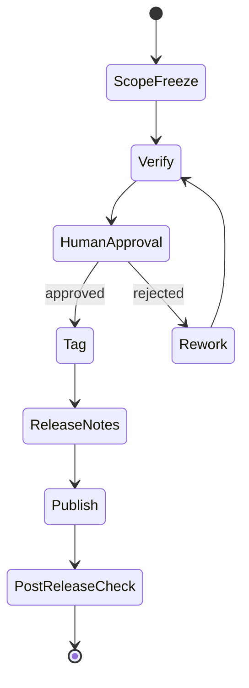

# Versioning

AI-OS uses Semantic Versioning for public releases.

## Version format

```text
vMAJOR.MINOR.PATCH
```

## Meaning

- MAJOR: breaking change to the operating model, prompt contract, or public structure
- MINOR: new loops, prompts, verifiers, examples, or diagrams
- PATCH: corrections, clarifications, small documentation fixes

## Release loop



## Human approval

All releases require explicit maintainer approval.
