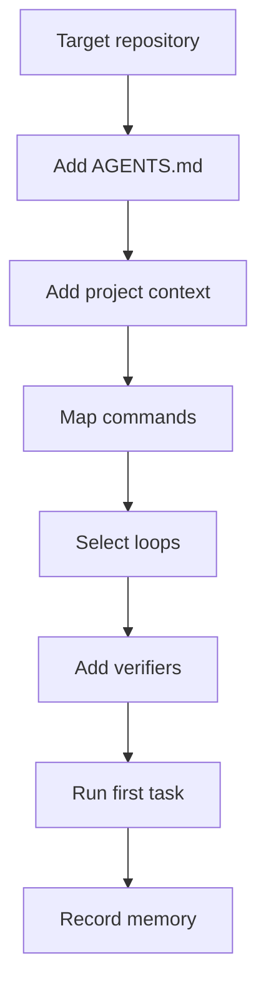

# Adoption Guide

Use this guide to apply AI-OS to a real project.

## Adoption flow

## Steps

1. Copy `templates/agent-instructions-template.md` into the target repository as `AGENTS.md`.
2. Copy `templates/complete-project-context.md` into the target repository docs.
3. Fill in build, test, lint, release, and security commands.
4. Choose the relevant loop for the first task.
5. Run the task through plan, work, verify, and document.
6. Store lessons in project memory.

## Good first tasks

- improve README
- add missing tests
- repair CI docs
- document release process
- add repository context
