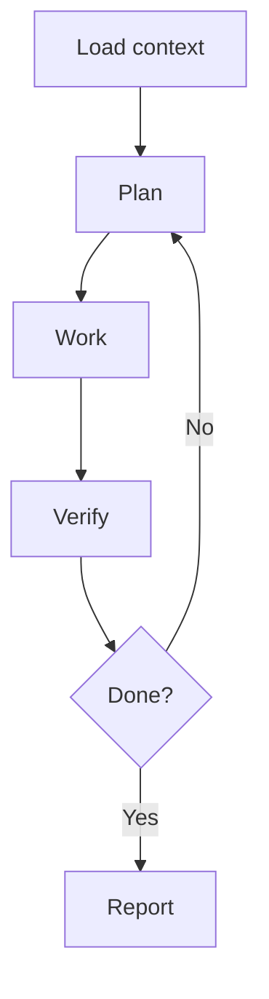

# Agent Compatibility

AI-OS is model- and tool-agnostic.

## Compatible agent types

- ChatGPT web sessions
- Claude Code style local agents
- Codex style coding agents
- Gemini CLI style coding agents
- Copilot coding agent workflows
- MCP-enabled local toolchains
- editor-integrated coding agents

## Compatibility rule

The agent does not need special support for every AI-OS concept. It only needs to follow the loop:

## Minimum support

- read files
- edit files
- explain plan
- run or request checks
- report evidence
