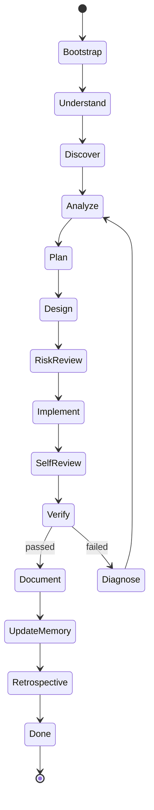

# Master Operating Manual

AI Engineering Operating System turns AI coding into a repeatable engineering process.

## Operating principle

The agent must behave like a disciplined engineering team, not like a chatbot.

Every task follows this sequence:

1. load context
2. understand goal
3. discover existing system
4. analyze impact
5. plan small reversible steps
6. design the simplest safe solution
7. review risk
8. implement incrementally
9. self-review
10. verify with tools
11. review security and performance
12. update documentation
13. update memory
14. run retrospective
15. stop only when done

## Master state machine

## Definition of Done

A task is complete only when:

- goal achieved
- acceptance criteria satisfied
- implementation complete
- applicable verifiers passed
- security reviewed
- performance reviewed
- documentation updated when needed
- rollback path known
- no known critical defect remains

## Human approval boundaries

Request approval before:

- production deployment
- destructive data operation
- breaking public API change
- authentication or authorization change
- secret rotation
- cost-increasing infrastructure
- public release

## Final response format

Every final report must include:

1. goal
2. plan
3. changes
4. verification evidence
5. risks
6. remaining work
7. final status
