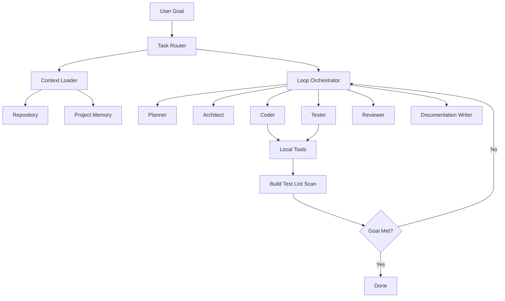

# Architecture

AI-OS is designed as a local-first operating model for AI coding agents.

## Reference architecture

## Core components

- Task router
- Context loader
- Loop orchestrator
- Specialist agents
- Tool adapters
- Verifier gates
- Memory updater
- Human approval gate

## Design goals

- local-first
- model-agnostic
- auditable
- repeatable
- safe by default
- useful for real repositories
