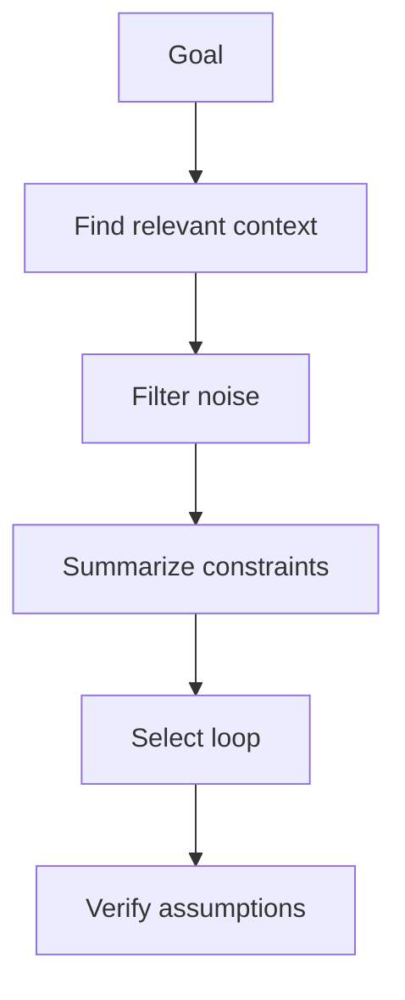

# Context Engineering

Context engineering is the discipline of giving the agent the right information at the right time.

## Context engineering loop

## Context layers

1. Repository purpose.
2. Current task.
3. Project instructions.
4. Architecture docs.
5. Relevant source files.
6. Tests and verifiers.
7. Recent failures or project memory.

## Rules

- Load less context when the task is narrow.
- Load more context when risk or uncertainty is high.
- Prefer repository evidence over memory.
- Keep assumptions explicit.
