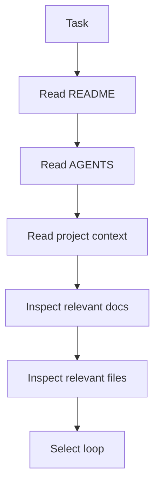

# Context Loading

Context loading is the first technical step in AI-OS work.

## Context loading flow

## Required context

- repository purpose
- active task goal
- relevant documentation
- relevant files
- build and test commands
- risk boundaries
- project memory

## Output

The agent should know which loop to use and which files are likely to matter before implementation starts.
