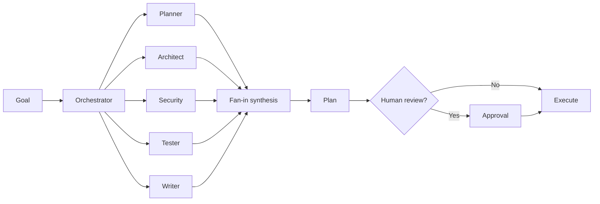

# Fan-out and Fan-in Orchestration

AI-OS uses specialist roles to reduce blind spots.

## Pattern

## Roles

- Planner: scope, steps, dependencies, risks
- Architect: system fit, interfaces, long-term shape
- Security: threat model and approval gates
- Tester: verifiers and evidence
- Writer: docs, examples, wiki, changelog

## Rule

The final plan must synthesize all specialist outputs into one coherent path. Disagreements should be documented as tradeoffs.
