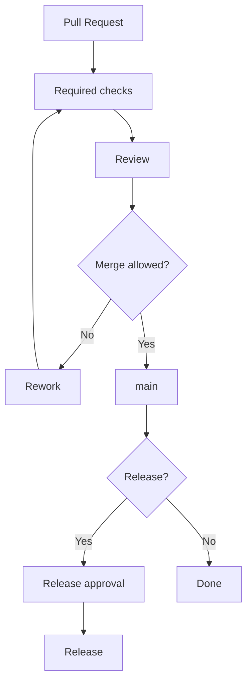

# Branch and Tag Rules

This repository should protect the public operating model through rulesets.

## Recommended `main` rules

- require pull request before merge
- require status checks
- require CODEOWNERS review when available
- block force pushes
- block deletion
- keep history linear if desired

## Recommended tag rules

- protect `v*` release tags
- block tag deletion
- block tag force updates
- require release workflow for public releases

## Approval flow

