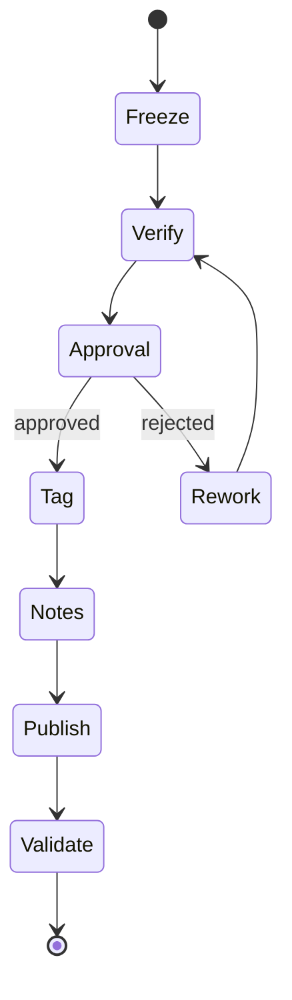

# Release Process

AI-OS releases are public signals of methodology stability.

## Process

1. Freeze scope.
2. Run full verification.
3. Update changelog.
4. Request human approval.
5. Create SemVer tag.
6. Generate release notes.
7. Validate published links.

## Mermaid

