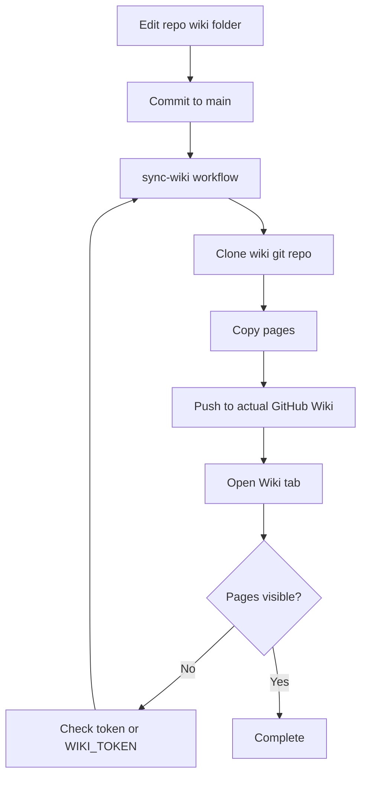

# Wiki Sync

The GitHub Wiki is a separate git repository. Files under this repository's `wiki/` folder do not appear in the actual Wiki tab until they are pushed to the wiki repository.

## Current solution

This repo includes `.github/workflows/sync-wiki.yml`.

Run it manually from GitHub Actions:

1. Open Actions.
2. Select `sync-wiki`.
3. Click `Run workflow`.
4. Check that the Wiki tab shows the pages.

## If the default token cannot push

Create a repository secret named `WIKI_TOKEN` with permission to write repository contents and wiki pages, then run the workflow again.

## Wiki source

Canonical wiki source files live in:

```text
wiki/
```

## Sync loop


