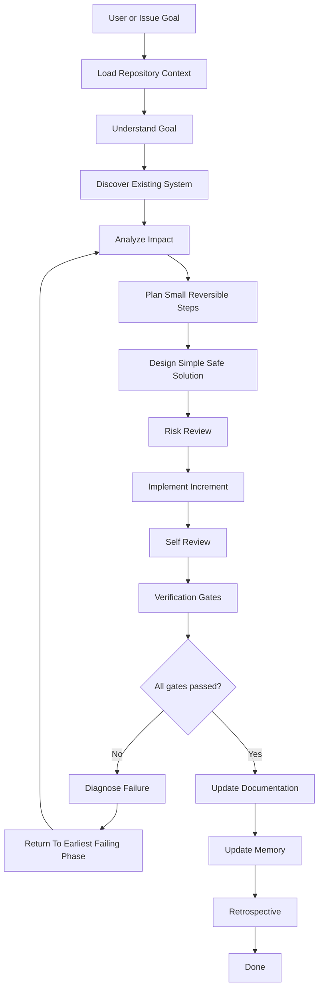
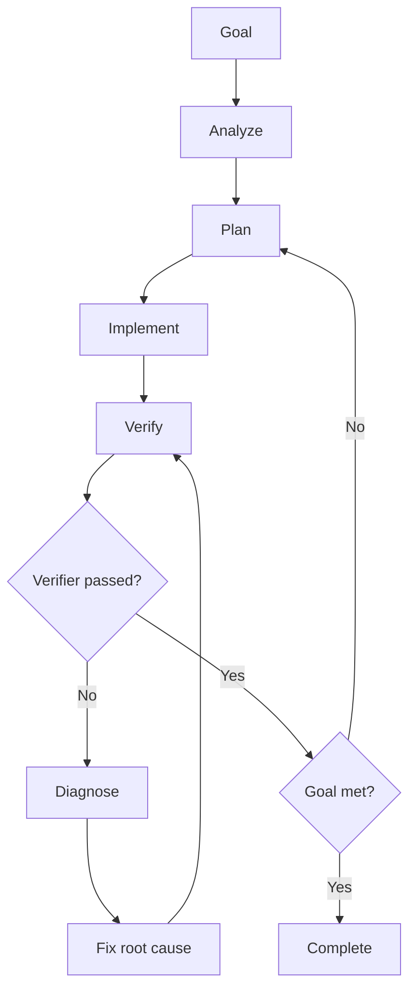
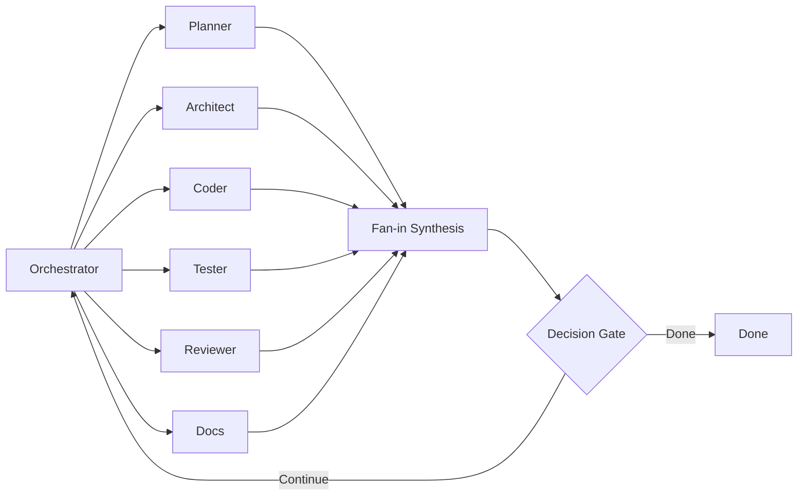
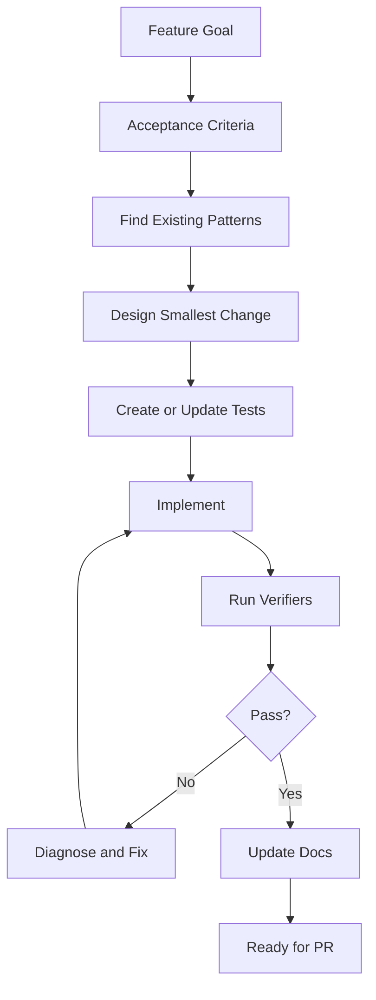
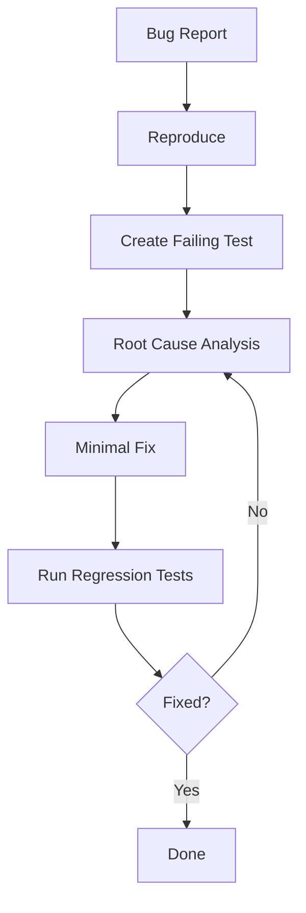
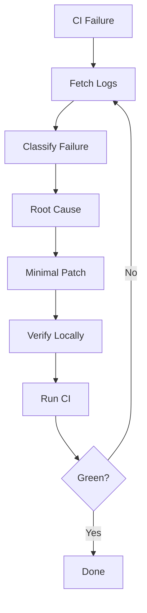
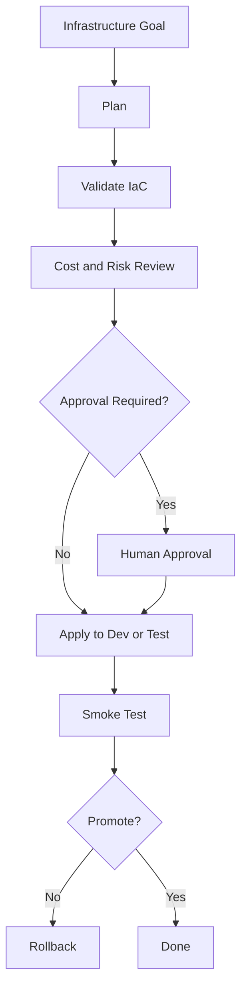
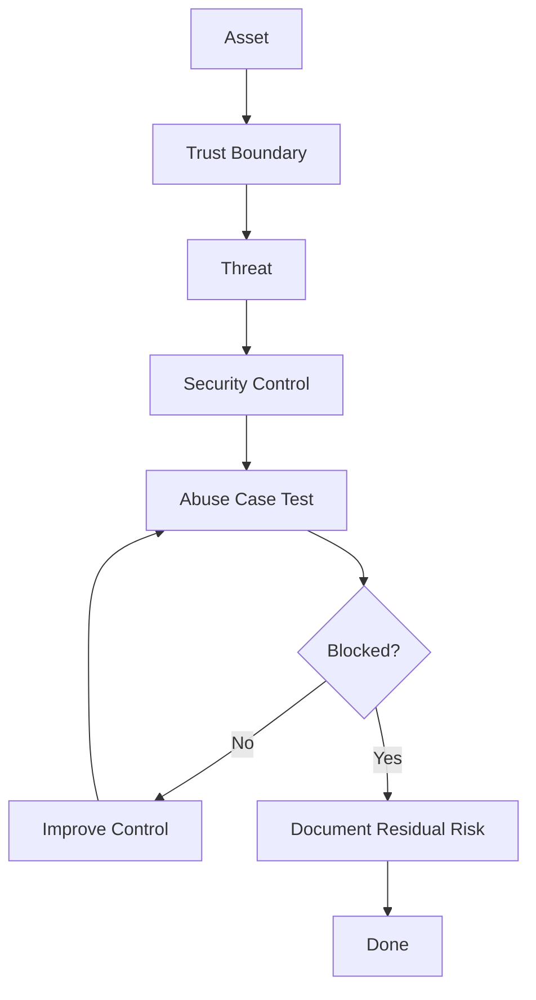
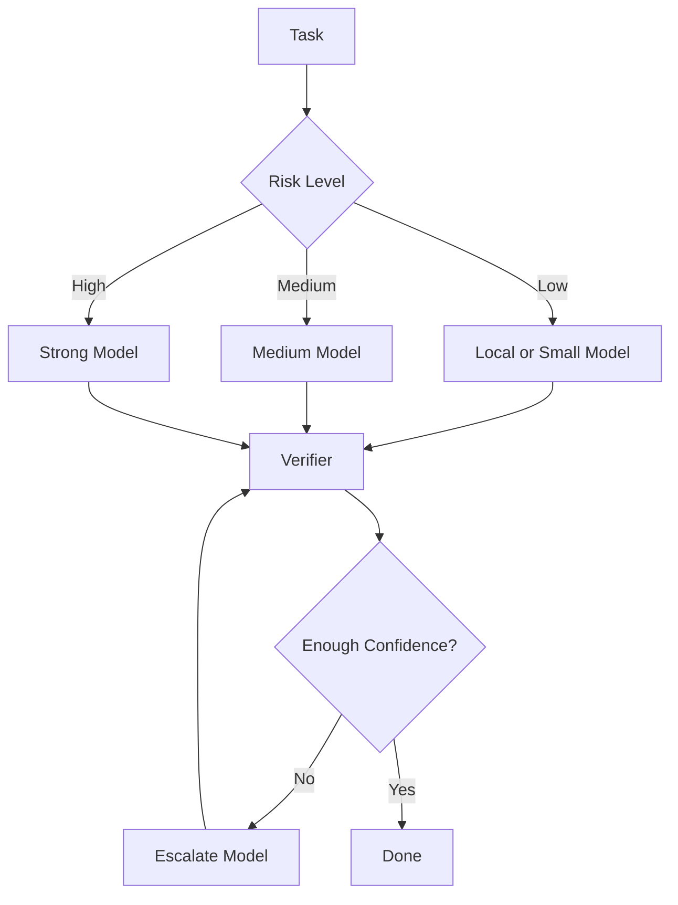
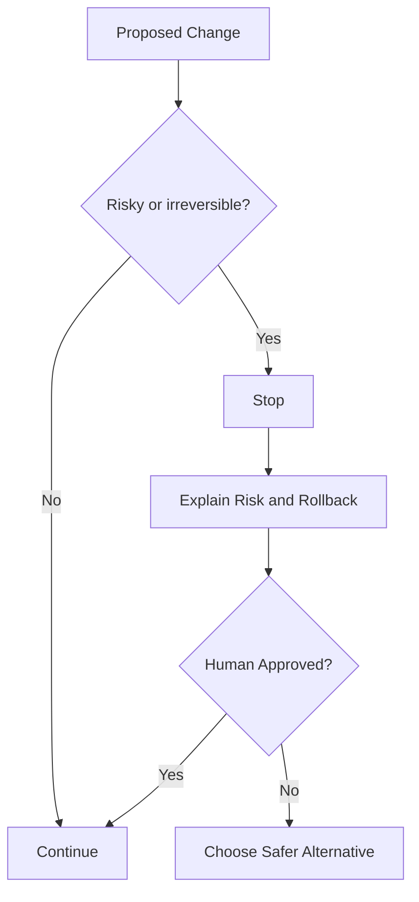

# Mermaid Diagram Catalog

This catalog documents the AI Engineering Operating System using Mermaid diagrams.

## 1. Full AI-OS lifecycle

## 2. Universal loop

## 3. Fan-out and fan-in agents

## 4. Feature development loop

## 5. Bug fix loop

## 6. CI/CD repair loop

## 7. Infrastructure loop

## 8. Security loop

## 9. Model routing loop

## 10. Human approval checkpoint

