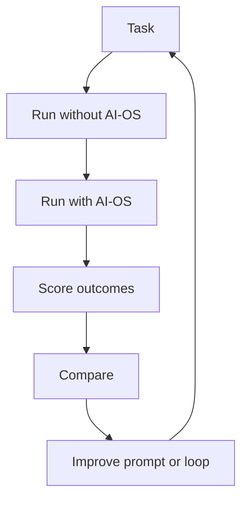

# Evaluations

Evaluations prove that AI-OS improves work quality instead of only adding process.

## Evaluation loop

## Suggested metrics

- goal completion
- verifier pass rate
- number of recovery loops
- documentation completeness
- security review completeness
- time to usable result
- number of unverified claims
- human approval correctness

## First eval set

- feature documentation task
- bugfix reasoning task
- CI failure triage task
- release checklist task
- wiki sync task
