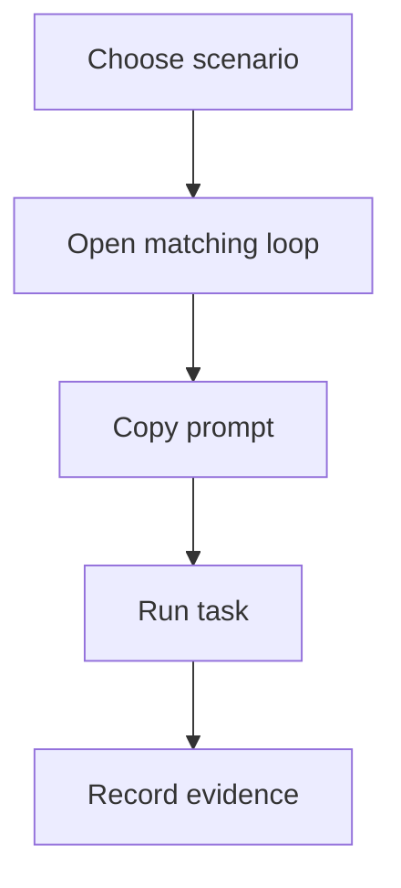

# Examples

Examples show how AI-OS is used in practical work.

## Example catalog

- Continuous improvement task: `examples/continuous-improvement-task.md`
- Wiki sync evaluation: `evals/wiki-sync.md`
- Project context template: `templates/complete-project-context.md`
- Agent instruction template: `templates/agent-instructions-template.md`

## Example loop

