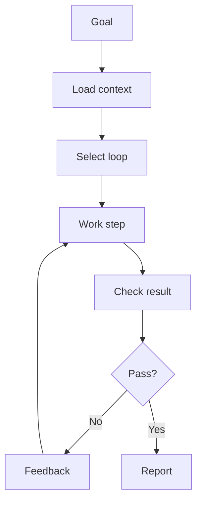

# Local Runner

The local runner is the future executable layer of AI-OS.

## Runner loop

## Minimum responsibilities

- read repository context
- select task loop
- run verifier commands
- capture evidence
- pause at approval gates
- update memory files

## First version

The first version can be a simple command-line wrapper.
