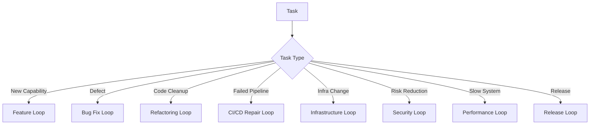

# Loop Catalog

This page defines reusable loops for AI-assisted software engineering.

## Loop selection

## Feature loop

Goal -> acceptance criteria -> design -> implement -> verify -> document -> done.

## Bug loop

Reproduce -> failing test -> root cause -> minimal fix -> regression -> done.

## Refactoring loop

Baseline -> characterization tests -> small change -> verify -> repeat.

## CI/CD loop

Logs -> classify -> root cause -> patch -> verify -> rerun CI.

## Infrastructure loop

Plan -> validate -> review risk -> approve if needed -> apply to lower environment -> smoke test.

## Security loop

Threat -> control -> abuse case -> verify -> residual risk.

## Performance loop

Measure -> hypothesize -> change -> benchmark -> keep or rollback.
