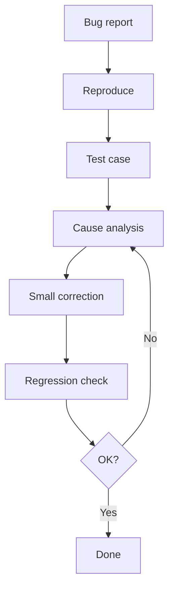

# Bug Fix Loop

```mermaid
flowchart TD
    A[Bug report] --> B[Reproduce]
    B --> C[Test case]
    C --> D[Cause analysis]
    D --> E[Small correction]
    E --> F[Regression check]
    F --> G{OK?}
    G -- No --> D
    G -- Yes --> H[Done]
```

## Rules

- Reproduce before changing when possible.
- Prefer a test case that proves the correction.
- Keep the correction minimal.
