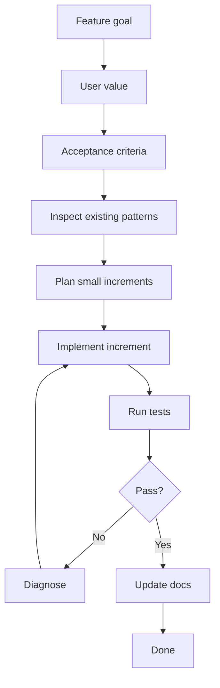

# Feature Development Loop

```mermaid
flowchart TD
    Goal[Feature goal] --> Value[User value]
    Value --> AC[Acceptance criteria]
    AC --> Context[Inspect existing patterns]
    Context --> Plan[Plan small increments]
    Plan --> Implement[Implement increment]
    Implement --> Test[Run tests]
    Test --> Pass{Pass?}
    Pass -- No --> Diagnose[Diagnose]
    Diagnose --> Implement
    Pass -- Yes --> Docs[Update docs]
    Docs --> Done[Done]
```

## Required outputs

- user story
- acceptance criteria
- affected files
- test plan
- verification evidence
- documentation update
