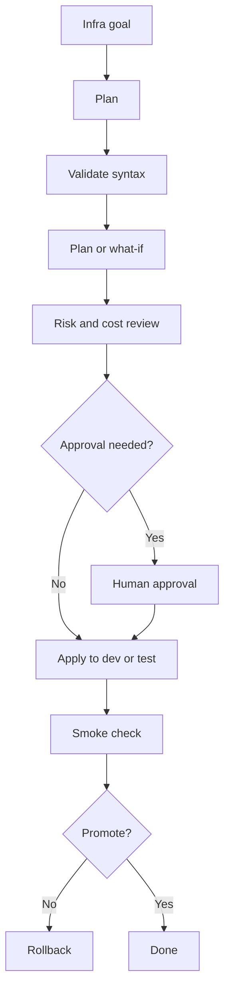

# Infrastructure as Code Loop

```mermaid
flowchart TD
    Goal[Infra goal] --> Plan[Plan]
    Plan --> Validate[Validate syntax]
    Validate --> Preview[Plan or what-if]
    Preview --> Risk[Risk and cost review]
    Risk --> Approval{Approval needed?}
    Approval -- Yes --> Human[Human approval]
    Approval -- No --> ApplyDev[Apply to dev or test]
    Human --> ApplyDev
    ApplyDev --> Smoke[Smoke check]
    Smoke --> Promote{Promote?}
    Promote -- No --> Rollback[Rollback]
    Promote -- Yes --> Done[Done]
```

## Approval required

- production change
- destructive change
- identity or permission change
- cost increase
