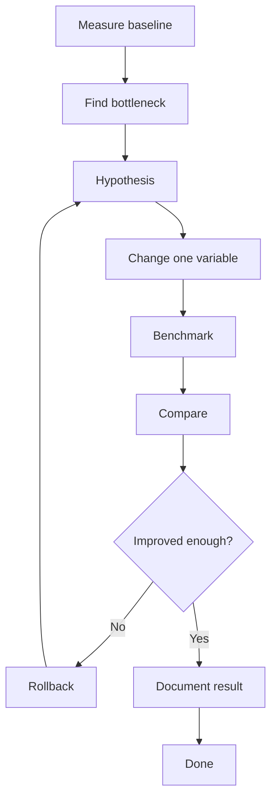

# Performance Loop

```mermaid
flowchart TD
    Baseline[Measure baseline] --> Bottleneck[Find bottleneck]
    Bottleneck --> Hypothesis[Hypothesis]
    Hypothesis --> Change[Change one variable]
    Change --> Benchmark[Benchmark]
    Benchmark --> Compare[Compare]
    Compare --> Keep{Improved enough?}
    Keep -- No --> Rollback[Rollback]
    Keep -- Yes --> Document[Document result]
    Rollback --> Hypothesis
    Document --> Done[Done]
```

## Rules

- Do not optimize without measurement.
- Change one thing at a time.
- Keep correctness checks running.
- Document the tradeoff.
