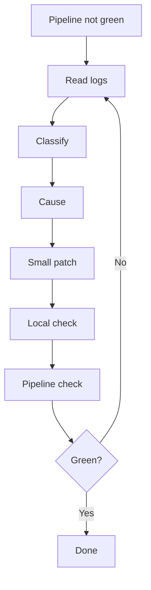

# Pipeline Repair Loop

## Classes

- build
- lint
- test
- dependency
- environment
- permission
- timeout
- configuration

## Evidence

Record the job name, cause, files changed, and verification result.
