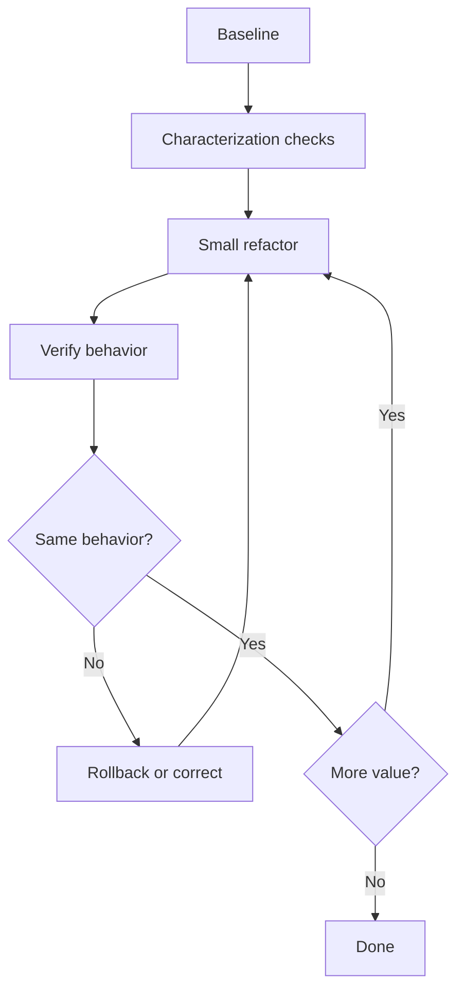

# Refactoring Loop

```mermaid
flowchart TD
    A[Baseline] --> B[Characterization checks]
    B --> C[Small refactor]
    C --> D[Verify behavior]
    D --> E{Same behavior?}
    E -- No --> F[Rollback or correct]
    F --> C
    E -- Yes --> G{More value?}
    G -- Yes --> C
    G -- No --> H[Done]
```

## Rules

- Do not change behavior unless requested.
- Establish a baseline first.
- Make one small transformation at a time.
- Stop when risk grows faster than value.
