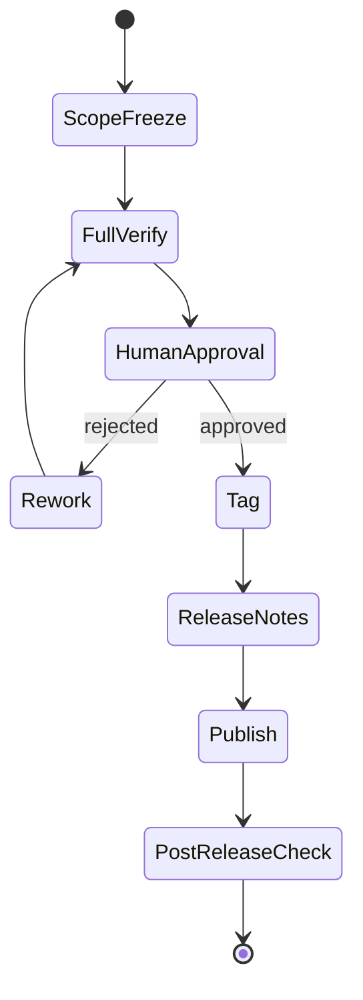

# Release Loop

```mermaid
stateDiagram-v2
    [*] --> ScopeFreeze
    ScopeFreeze --> FullVerify
    FullVerify --> HumanApproval
    HumanApproval --> Rework: rejected
    Rework --> FullVerify
    HumanApproval --> Tag: approved
    Tag --> ReleaseNotes
    ReleaseNotes --> Publish
    Publish --> PostReleaseCheck
    PostReleaseCheck --> [*]
```

## Release requirements

- version follows `VERSIONING.md`
- changelog updated
- docs checks pass
- release workflow uses a human approval gate
- generated release notes reviewed
