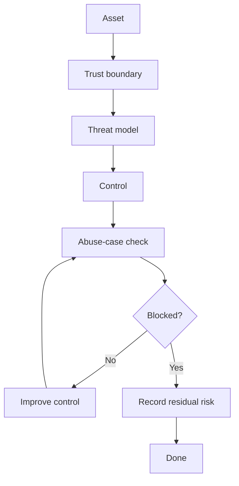

# Security Review Loop

```mermaid
flowchart TD
    Asset[Asset] --> Boundary[Trust boundary]
    Boundary --> Threat[Threat model]
    Threat --> Control[Control]
    Control --> Check[Abuse-case check]
    Check --> Pass{Blocked?}
    Pass -- No --> Improve[Improve control]
    Improve --> Check
    Pass -- Yes --> Residual[Record residual risk]
    Residual --> Done[Done]
```

## Required outputs

- asset
- trust boundary
- likely threats
- control
- verification
- residual risk
