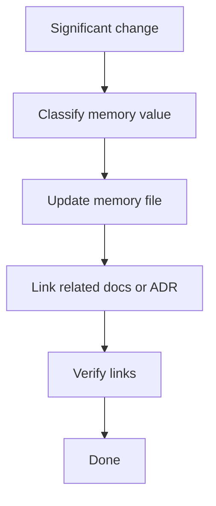

# Project Memory

Project memory captures decisions, reusable patterns, and lessons.

## Memory update loop



## Record format

```markdown
## YYYY-MM-DD - Title

Decision:
Context:
Consequences:
Related files:
Verification:
Next improvement:
```

## When to update

- operating model changes
- new loop or verifier
- security or governance change
- repeated issue discovered
- useful pattern found
