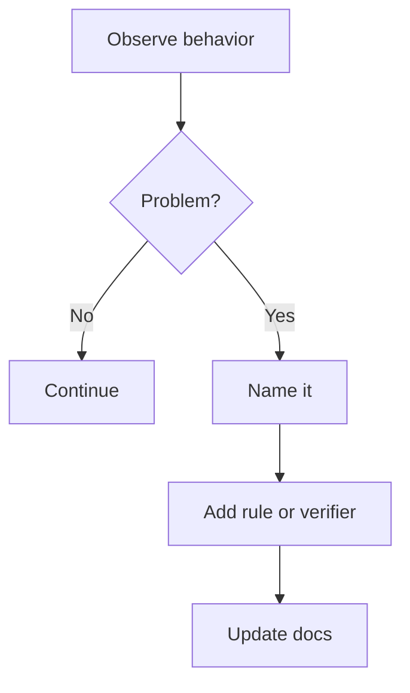

# Anti-patterns

AI-OS exists to reduce common AI coding failure modes.

## Anti-pattern loop

## Common anti-patterns

- Coding before understanding the goal.
- Skipping repository context.
- Making broad changes without a plan.
- Treating self-review as proof.
- Not updating docs after behavior changes.
- Leaving wiki and docs inconsistent.
- Creating automation without approval gates.
- Optimizing without measurement.
- Refactoring without baseline checks.
