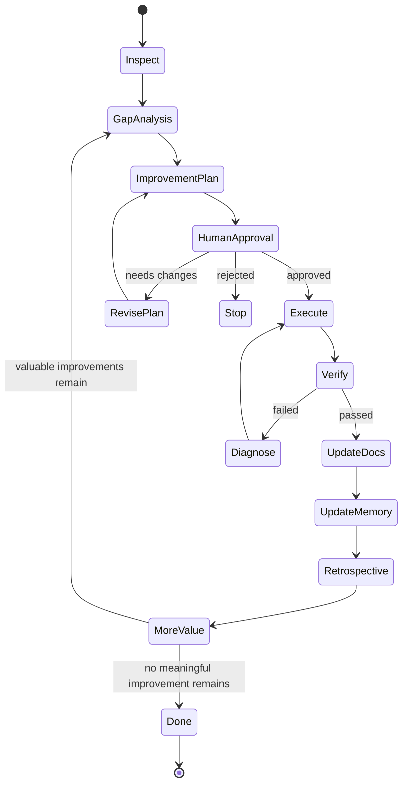
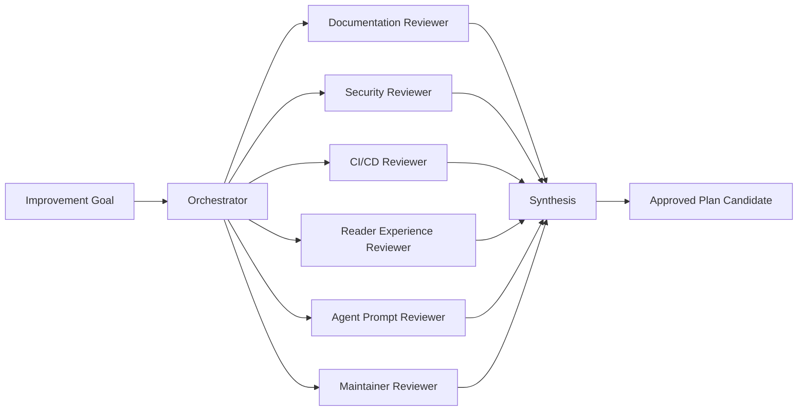

# Continuous Improvement Loop

AI-OS must improve itself through an explicit loop. The agent does not silently mutate the project. It first creates a plan and asks for human approval when the scope is broad, risky, public, or structural.

## Continuous improvement state machine

## Rules

1. Inspect the current repository state.
2. Fan out analysis to specialist roles.
3. Produce a prioritized plan.
4. Ask the human to approve the plan before broad changes.
5. Execute only the approved scope.
6. Verify with strong gates when possible.
7. Update docs, wiki navigation, roadmap, and memory.
8. Repeat until only optional low-value improvements remain.

## Specialist fan-out

## Approval boundary

Approval is required before:

- changing governance
- changing release process
- changing security policy
- creating automation that writes to GitHub
- merging or releasing
- broad repository restructuring

## Definition of complete

The loop is complete when:

- the original goal is satisfied
- the plan was followed or deviations were documented
- verifiers passed or exceptions are explicit
- docs and wiki are updated
- no high-value improvement remains in the current scope
