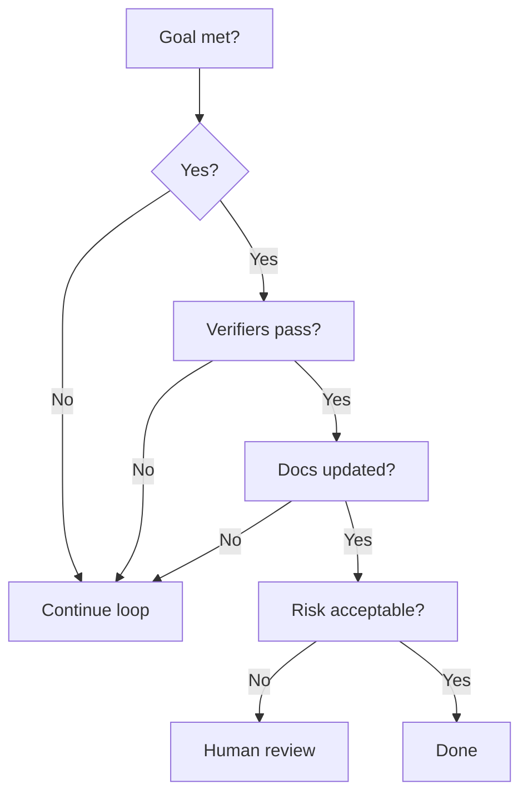

# Definition of Done

A task is done only when every required gate is satisfied.

## Required checks

- Goal is achieved.
- Acceptance criteria are satisfied.
- Work is implemented in the intended scope.
- Relevant verification was run.
- Security and performance were considered.
- Documentation was updated when behavior changed.
- Wiki navigation was updated when public docs changed.
- Rollback or revert path is known.
- Remaining work is documented.

## Done decision

