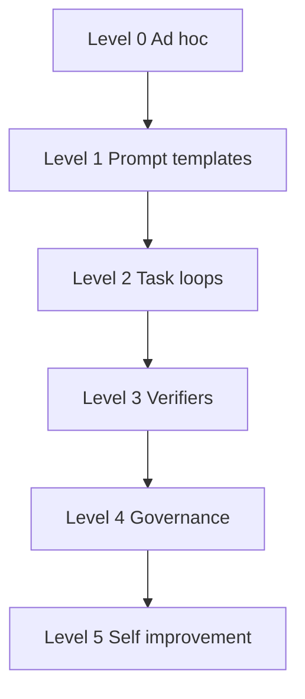

# AI-OS Maturity Model

Use this model to evaluate how mature an AI-assisted engineering workflow is.

## Levels

- Level 0: ad hoc chat.
- Level 1: reusable prompts exist.
- Level 2: task-specific loops exist.
- Level 3: verifiers decide completion.
- Level 4: CI, governance, release, and security controls exist.
- Level 5: the system improves itself through a planned and reviewed loop.

## Target

This repository targets Level 5 for documentation and methodology, then moves toward executable local tooling.
