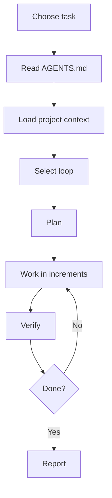

# Quickstart

Use this page to apply AI-OS to any repository.

## Quickstart loop



## Minimal prompt

```text
Execute AI-OS.
Task: [describe task]
Load context, choose the loop, plan, work, verify, and report evidence.
```

## First repository setup

1. Add `AGENTS.md`.
2. Add project context.
3. Add verifier commands.
4. Add loop-specific prompts.
5. Add CI checks.
