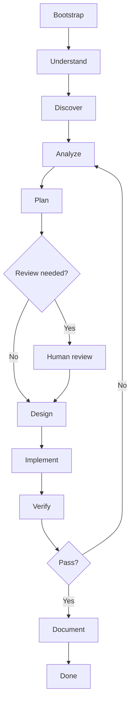

# AI-OS State Machine

```mermaid
flowchart TD
    A[Bootstrap] --> B[Understand]
    B --> C[Discover]
    C --> D[Analyze]
    D --> E[Plan]
    E --> F{Review needed?}
    F -- Yes --> G[Human review]
    F -- No --> H[Design]
    G --> H
    H --> I[Implement]
    I --> J[Verify]
    J --> K{Pass?}
    K -- No --> D
    K -- Yes --> L[Document]
    L --> M[Done]
```

Every task moves through the same controlled process. The agent plans first, verifies before completion, and loops back when a check does not pass.
