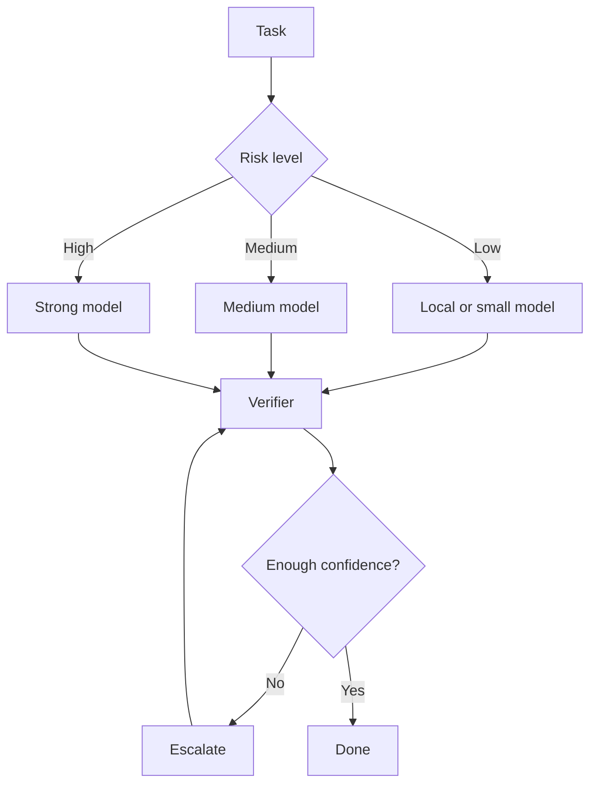

# Local-first Model Routing Policy

AI-OS prefers local or cheaper models for low-risk work and escalates only when needed.

## Routing loop

## Guidance

- Use local models for summaries, search, boilerplate, and formatting.
- Use stronger models for architecture, security, hard debugging, and final review.
- Escalate only when confidence is low or risk is high.
