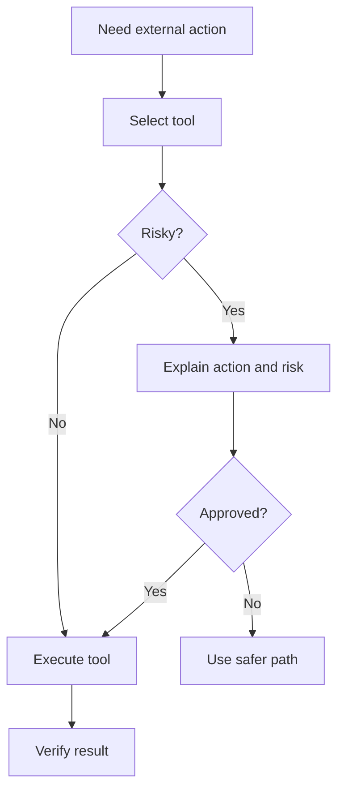

# MCP Integration Model

Model Context Protocol fits AI-OS as the tool and context boundary.

## AI-OS mapping

| MCP concept | AI-OS role |
|---|---|
| Resources | repository context, docs, schemas, logs |
| Prompts | reusable loops and scenario prompts |
| Tools | controlled actions such as search, test, issue, PR, deploy |
| Human confirmation | approval gates before risky actions |

## Tool-use gate

## Rule

MCP tools should be visible, auditable, and bounded by approval gates.
