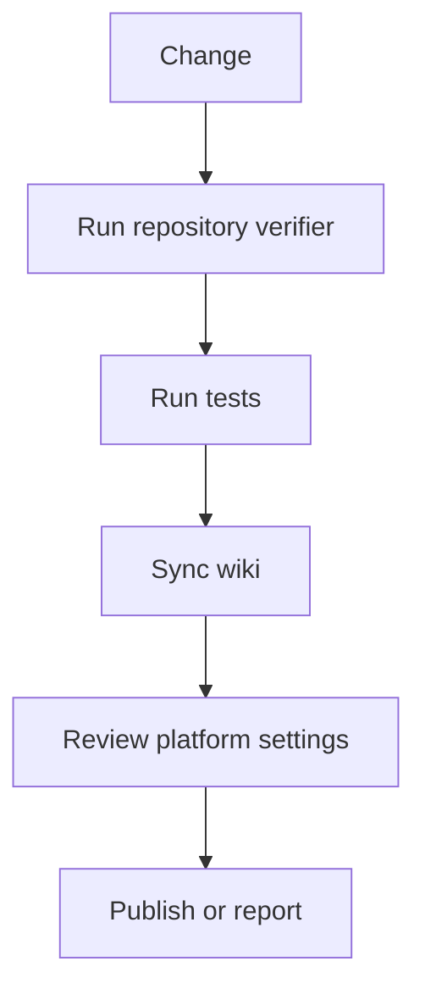

# Operations

Operations pages describe how to keep AI-OS healthy after publication.

## Operating loop

## Routine checks

- CI docs workflow is green.
- Wiki sync workflow has run after wiki source changes.
- Open dependency PRs are reviewed.
- Release environment still requires review.
- Repository description and topics match the project purpose.
- README links still work.
