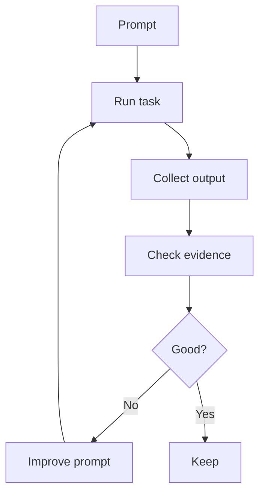

# Prompt Quality

Prompt quality in AI-OS is measured by whether the prompt produces safe, verifiable engineering behavior.

## Quality loop

## Quality criteria

- goal is clear
- loop is selected
- plan appears before work
- verifier evidence is included
- risks are explicit
- docs are updated when needed
- remaining work is stated
