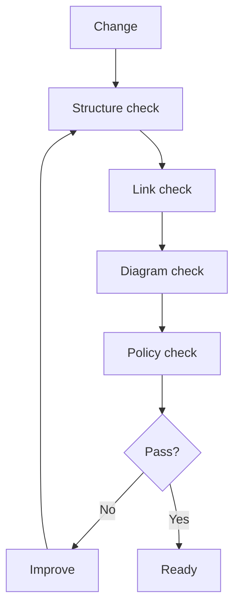

# Quality System

AI-OS quality is based on evidence, not confidence.

## Quality loop

## Quality gates

- required files exist
- Markdown files have titles
- key docs include Mermaid diagrams
- relative links resolve
- work-marker text is not left in docs
- CI can run the verifier
