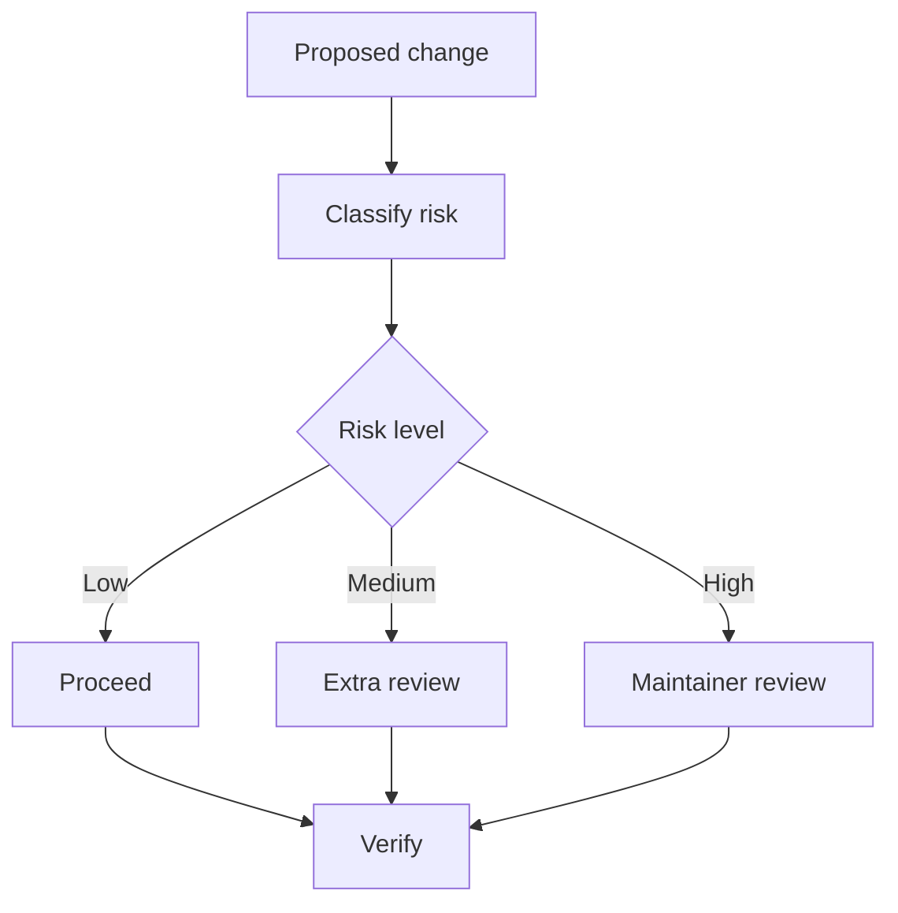

# Risk Model

AI-OS separates low-risk documentation work from high-risk automation, release, and security work.

## Risk loop

## Risk levels

- Low: documentation correction, link update, diagram addition.
- Medium: workflow change, release note change, governance clarification.
- High: release process, security policy, repository automation, public publication workflow.

## Output

Every meaningful change should state risk level and verification evidence.
