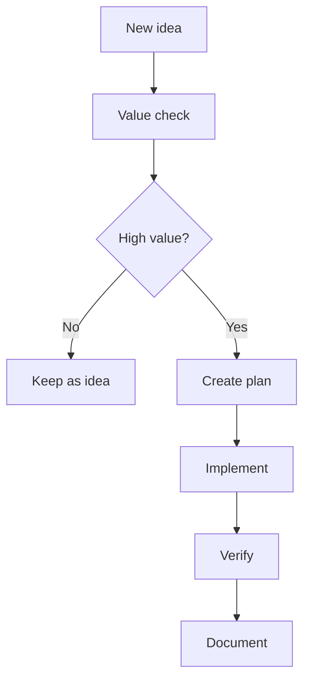

# Roadmap

AI-OS is currently ready as a public methodology repository. Future roadmap items are implementation expansions rather than missing documentation foundations.

## Current capability

- Public documentation
- Agent instructions
- Loop catalog
- Prompt catalog
- Verifier catalog
- Governance model
- Security policy
- Release model
- Wiki source pages
- CI structure checks
- Evaluation framework
- Templates for adopting AI-OS in other repositories

## Next expansion areas

1. Executable local runner.
2. Example repositories using AI-OS.
3. Evaluation result history.
4. Optional documentation site.
5. More integrations with coding agents and MCP tools.

## Roadmap loop

