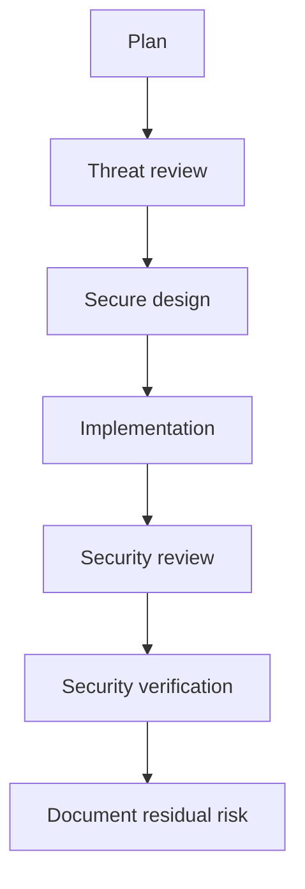

# Secure SDLC Mapping

AI-OS aligns with secure software development by making security part of every loop.

## Security integration points

## AI-OS controls

- human approval for security-sensitive changes
- tool-use visibility
- secret handling rules
- dependency review
- CI/CD safety checks
- release approval gates
- ADRs for security-impacting decisions

## Output

Every security-sensitive change should include threat, control, verifier, and residual risk.
