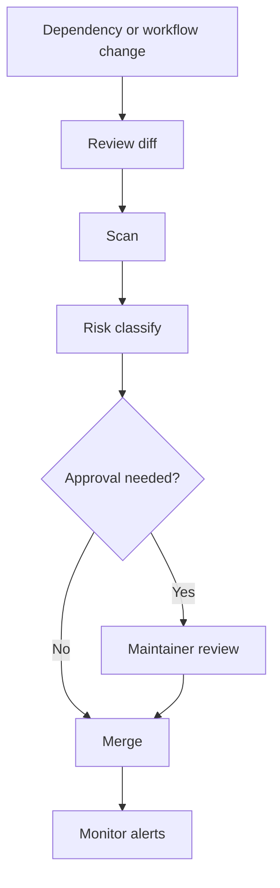

# Supply Chain Security

AI-OS treats workflows, dependencies, prompts, and tool access as part of the supply chain.

## Supply chain loop

## Controls

- Dependabot configuration
- dependency review workflow
- secret scanning
- CodeQL for future scripts
- protected release workflow
- documented SBOM/provenance guidance
