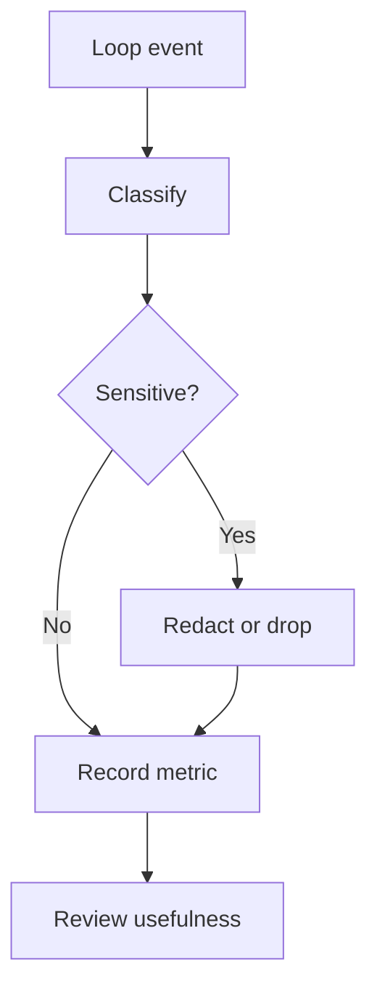

# Telemetry and Privacy

AI-OS should be privacy-first.

## Principles

- No telemetry by default.
- Prefer local logs for local workflows.
- Do not collect secrets, prompts, private code, or personal data.
- Make any telemetry opt-in and documented.
- Keep observability useful for debugging loops and verifier outcomes.

## Observability loop

## Useful metrics

- loop count
- verifier pass rate
- time to recover
- docs drift
- release readiness
- model escalation count
