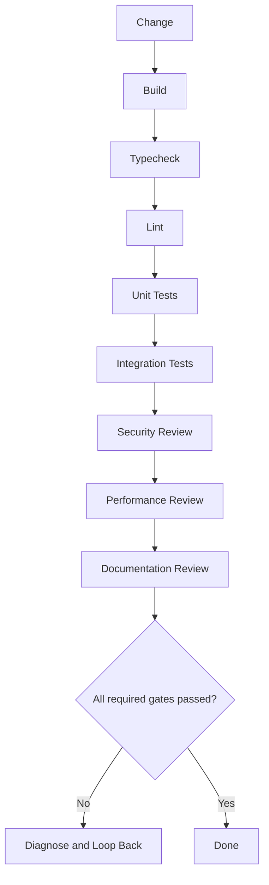

# Verification Gates

AI-OS treats verification as the decision maker.

## Verification pipeline

## Strong verifiers

- build
- typecheck
- lint
- unit tests
- integration tests
- smoke tests
- dependency audit
- container build
- infrastructure validation
- benchmark

## Weak verifiers

- self-review
- checklist review
- manual reading

Weak verifiers can support decisions, but they should not replace strong verifiers when strong verifiers are available.
