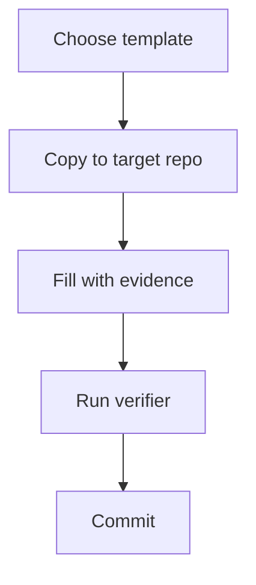

# Templates

Reusable templates for applying AI-OS to other repositories.

## Available templates

- `project-context.md` - project context file for an existing repository
- `repository-context-template.md` - expanded repository context template
- `agent-instructions-template.md` - starter AGENTS.md file

## Template loop

