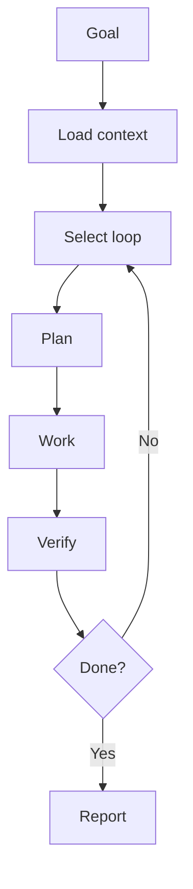

# Agent Instructions Template

Use this file as `AGENTS.md` in a target repository.

## Operating model

Follow AI Engineering Operating System.



## Required behavior

- Read repository context before editing.
- Select the appropriate loop.
- Plan before implementation.
- Keep changes small and reversible.
- Run available verifiers.
- Update docs when behavior changes.
- Report evidence honestly.

## Repository-specific commands

```text
Build:
Test:
Lint:
Security:
Docs:
```
