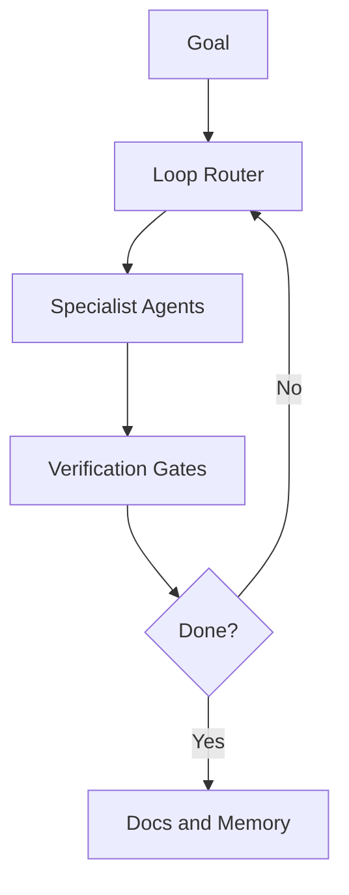

# Architecture Guide

Canonical architecture docs are in docs/architecture.

## Overview

## Pages

- docs/architecture/README.md
- docs/architecture/fan-out-fan-in.md
- docs/methodology/continuous-improvement-loop.md
