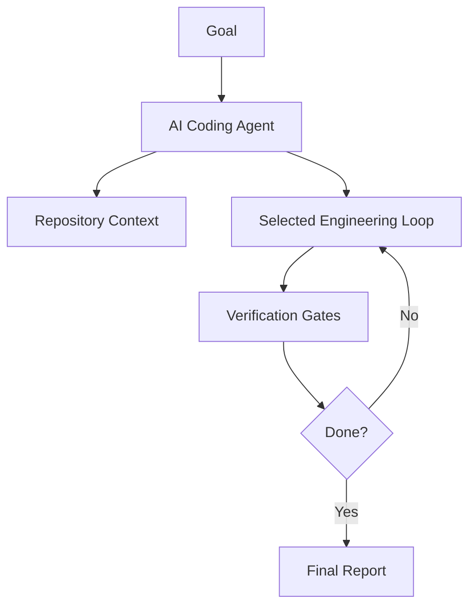

# AI Engineering Operating System Wiki

Welcome to the AI-OS wiki.

## Main pages

- [Master Operating Manual](../docs/ai-os/master-operating-manual.md)
- [Mermaid Diagram Catalog](../docs/diagrams/README.md)
- [Loop Catalog](../docs/loops/README.md)
- [Prompt Templates](../prompts/README.md)

## What this is

AI-OS is a repeatable operating framework for AI coding agents.

The core idea:

```text
Prompt once.
Verify everything.
Loop until the goal is achieved.
Escalate when risk requires human approval.
```

## System overview


